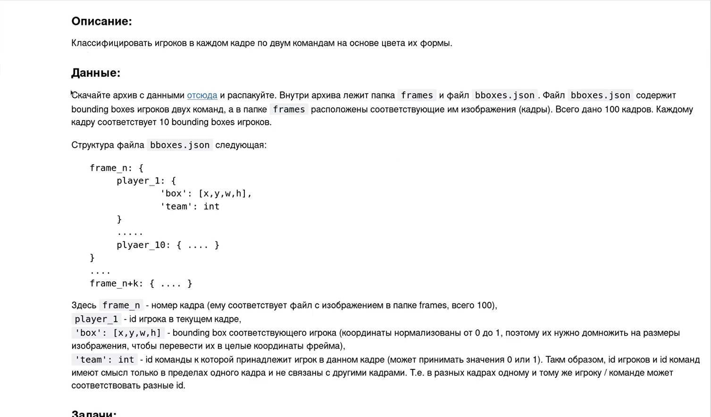
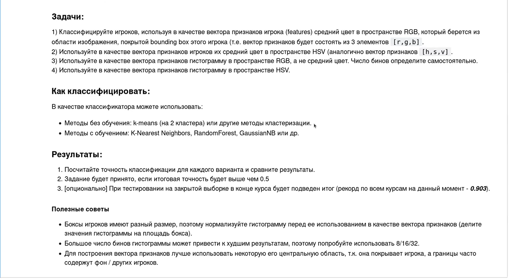

# Домашнее задание
Классифицировать игроков в каждом кадре по двум командам на основе цвета их формы

# Цель:
## ОСНОВНОЕ ЗАДАНИЕ:
Скачайте архив с данными https://disk.yandex.ru/d/NMlVHytktlzbEw и распакуйте. Внутри архива лежит папка 
frames и файл bboxes.json. Файл bboxes.json содержит bounding boxes игроков двух команд, а в папке frames 
расположены соответствующие им изображения (кадры). Всего дано 100 кадров. Каждому кадру соответствует 10 
bounding boxes игроков.

Структура файла bboxes.json следующая:

```json
frame_n: {
    player_1: {
        'box': [x,y,w,h],
        'team': int
},
.....
    plyaer_10: { .... }
}
....
frame_n+k: { .... }
```

Здесь `frame_n` - номер кадра (ему соответствует файл с изображением в папке frames, всего 100),  
`player_1` - id игрока в текущем кадре,  
`'box': [x,y,w,h]` - bounding box соответствующего игрока (координаты нормализованы от 0 до 1, поэтому их нужно 
домножить на размеры изображения, чтобы перевести их в целые координаты фрейма),  
`'team': int` - id команды к которой принадлежит игрок в данном кадре (может принимать значения 0 или 1). Таким 
образом, id игроков и id команд имеют смысл только в пределах одного кадра и не связаны с другими кадрами.   
Т.е. в разных кадрах одному и тому же игроку / команде может соответствовать разные id.

## ТЕСТИРОВАНИЕ НА ЗАКРЫТОЙ ВЫБОРКЕ (опционально):
Скачайте архив с тестовыми данными https://disk.yandex.ru/d/oSRWELxpClOasg и распакуйте. Внутри архива 100 
изображений в папке frames (из той же игры), и файл bboxes_test.json, который содержит только bounding boxes 
игроков (и не содержит полей 'team').
Используйте вашу лучшую модель классификатора на эти данных. В качестве результата загрузите в ЛК файл 
test_results.json который должен содержать следующие данные (пример файла можно посмотреть здесь 
https://disk.yandex.ru/d/ODjibULNGtVnNw):

```
frame_n: {
player_1: team_id,
.....
plyaer_10: team_id
},
....
frame_n+k: { .... }
```
где `team_id` - метка команды (0 или 1).
После этого преподаватель сообщит вам accuracy вашей модели на тестовых данных.


# Описание/Пошаговая инструкция выполнения домашнего задания:
##  Задачи:
1. Классифицируйте игроков, используя в качестве вектора признаков игрока (features) средний цвет в пространстве 
RGB, который берется из области изображения, покрытой bounding box этого игрока (т.е. вектор признаков будет 
состоять из 3 элементов [r,g,b]).
2. Используйте в качестве вектора признаков игроков их средний цвет в пространстве HSV (аналогично вектор 
признаков [h,s,v]).
3. Используйте в качестве вектора признаков гистограмму в пространстве RGB, а не средний цвет. Число бинов 
определите самостоятельно.
4. Используйте в качестве вектора признаков гистограмму в пространстве HSV.

## Как классифицировать: В качестве классификатора можете использовать (любой на выбор):
- Методы без обучения: k-means (на 2 кластера) или другие методы кластеризации.
- Методы с обучением: K-Nearest Neighbors, RandomForest, GaussianNB или др.

# Критерии оценки:
1. Посчитайте точность классификации для четырех задач и сравните результаты.
2. Задание будет принято, если итоговая точность на основной выборке будет выше чем 0.5.
3. [опционально] При тестировании на закрытой выборке в конце курса будет подведен итог (рекорд по всем курсам 
на данный момент - ?).



